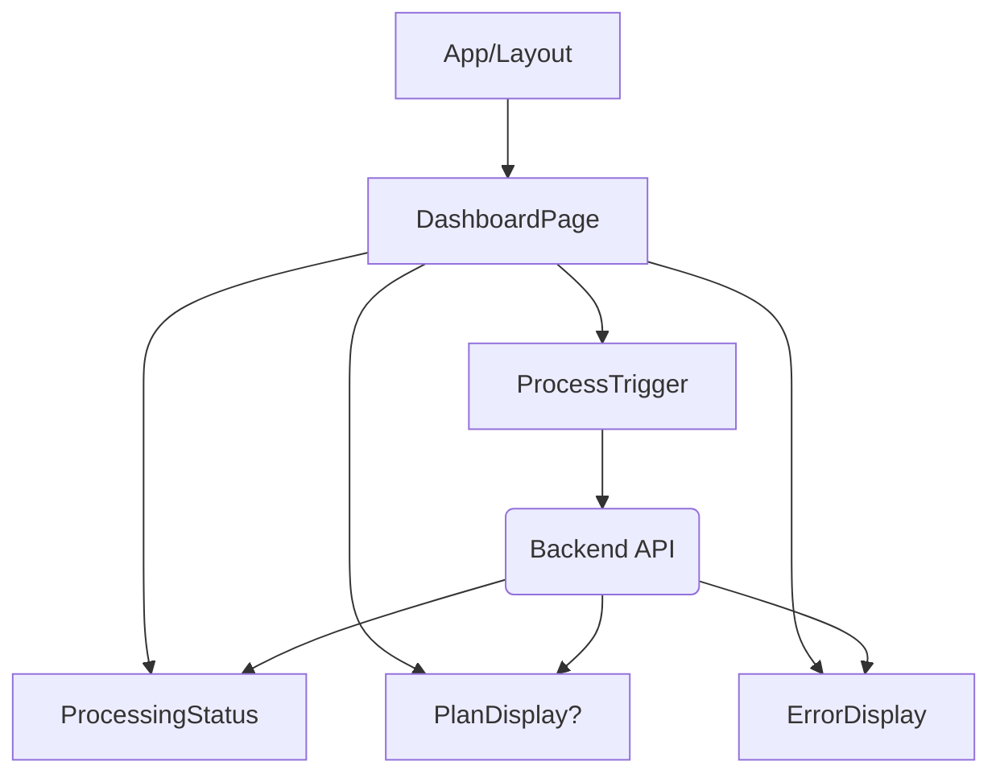

```markdown
# Frontend Implementation Guide: Wellness Plan Generator

## Version: 1.0
## Date: May 13, 2025

---

This document outlines the frontend implementation strategy for a system that processes Google Form wellness data (stored in AWS S3), uses the data via the ChatGPT-4o API to generate a personalized wellness plan PDF, stores the PDF back in S3, and delivers it to the client via WhatsApp and Email.

The frontend's primary role in this architecture is to provide a user interface for triggering the processing pipeline and displaying the status and outcome to an administrator or potentially the client themselves (depending on the exact user flow). The heavy lifting (S3 interaction, API calls, PDF generation, sending) is handled by a backend service.

## 1. Component Architecture

The frontend application will follow a component-based architecture, typical of modern JavaScript frameworks like React, Vue, or Angular. For simplicity and illustrative purposes, examples will loosely follow a React-like structure.

The core components would include:

1.  **`App` (or `Layout`):** The root component defining the overall structure and routing (if necessary).
2.  **`DashboardPage`:** The main view component where the user interacts with the system.
3.  **`ProcessTrigger`:** A component containing the button or mechanism to initiate the processing of a form submission.
4.  **`ProcessingStatus`:** A component to display the current status of the backend process (e.g., "Idle", "Fetching Data", "Generating Plan", "Sending PDF", "Success", "Error").
5.  **`PlanDisplay` (Optional):** A component to render or link to the generated PDF after successful processing.
6.  **`ErrorDisplay`:** A component to show detailed error messages if the process fails.



*   **`App`**: Handles global layout, potentially routing.
*   **`DashboardPage`**: Orchestrates `ProcessTrigger`, `ProcessingStatus`, `PlanDisplay`, and `ErrorDisplay`. It manages the state related to the processing flow.
*   **`ProcessTrigger`**: A button. When clicked, it calls a function passed down from `DashboardPage` to start the process via an API call. It should be disabled while processing.
*   **`ProcessingStatus`**: Receives status updates (string or object) as props from `DashboardPage` and renders appropriate messages and indicators (e.g., loading spinner).
*   **`PlanDisplay`**: Receives the PDF URL as a prop (if available) and renders a link or embeds the PDF (e.g., using an `<iframe>` or a PDF viewer library).
*   **`ErrorDisplay`**: Receives error details as props and displays them.

## 2. State Management

The primary state managed by the frontend application (specifically within the `DashboardPage` component or a state management layer it uses) will revolve around the backend processing lifecycle.

Key state variables:

*   `processing`: Boolean, `true` when a backend process is active, `false` otherwise. Controls UI elements like disabling the trigger button and showing a loading indicator.
*   `status`: String, reflects the current step or outcome of the backend process (e.g., 'idle', 'fetching data', 'generating plan', 'sending', 'success', 'error'). Used by `ProcessingStatus`.
*   `error`: Object or String, contains error details if the process fails. Used by `ErrorDisplay`.
*   `planUrl`: String (optional), the URL of the generated PDF in S3 upon success. Used by `PlanDisplay`.
*   `lastProcessedFormId`: String (optional), identifier of the form that was just processed. Could be displayed for confirmation.

For this relatively simple scope, component-level state (e.g., React's `useState` hooks) is sufficient within the `DashboardPage`. If the application grows or the processing status needs to be accessed by unrelated components, a context API (React), Vuex (Vue), or a similar global state management pattern might be considered.

**State Flow:**

1.  Initial State: `processing: false`, `status: 'Idle'`, `error: null`, `planUrl: null`.
2.  User clicks `ProcessTrigger`: Set `processing: true`, `status: 'Starting Process...`. Make API call.
3.  API call receives progress updates (via polling or websockets - polling is simpler for v1.0): Update `status` accordingly ('Fetching Data', 'Generating Plan', etc.).
4.  API call succeeds: Set `processing: false`, `status: 'Success!'`, `planUrl: <received_url>`, `error: null`.
5.  API call fails: Set `processing: false`, `status: 'Error'`, `error: <received_error_details>`, `planUrl: null`.

## 3. UI Design

The user interface should be intuitive and provide clear feedback on the process status.

**Layout:**

*   A main container (e.g., a `div` with padding).
*   A clear heading (e.g., "Wellness Plan Generator").
*   The `ProcessTrigger` button prominently displayed.
*   An area dedicated to the `ProcessingStatus`, perhaps below the button. This area updates dynamically.
*   If successful, the `PlanDisplay` area appears, showing a link or embedding the PDF.
*   If an error occurs, the `ErrorDisplay` area appears, showing the error message.

**User Interaction:**

*   The trigger button should be the primary interaction point.
*   The button should visually indicate when it's disabled (e.g., grayed out) during processing.
*   The status text should be clear and update in near real-time (or reflect the last known state from polling).
*   Links to the PDF should open in a new tab/window.

**Example Structure (Pseudo HTML/JSX):**

```html
<div class="container">
  <h1>Wellness Plan Generator</h1>

  <!-- Process Trigger Component -->
  <div id="process-trigger">
    <button disabled={processing} onclick="startProcessing()">
      {processing ? 'Processing...' : 'Process Latest Form Submission'}
    </button>
  </div>

  <!-- Processing Status Component -->
  <div id="processing-status">
    <p>Status: {status}</p>
    {processing && <div class="spinner"></div>} {/* Simple loading indicator */}
  </div>

  <!-- Plan Display Component (shown on success) -->
  {status === 'Success!' && planUrl && (
    <div id="plan-display">
      <h2>Plan Generated Successfully!</h2>
      <a href={planUrl} target="_blank" rel="noopener noreferrer">View/Download Plan PDF</a>
    </div>
  )}

  <!-- Error Display Component (shown on error) -->
  {status === 'Error' && error && (
    <div id="error-display">
      <h2>Error Occurred</h2>
      <p>{error.message || 'An unknown error occurred.'}</p>
      {error.details && <pre>{JSON.stringify(error.details, null, 2)}</pre>}
    </div>
  )}
</div>
```

CSS would be applied to style these elements, create the spinner animation, etc.

## 4. API Integration

The frontend needs to communicate with a backend API that orchestrates the S3, ChatGPT, and communication tasks. We assume a single main endpoint for simplicity in this guide.

**Endpoint:**

*   `POST /api/process-wellness-data`

**Request:**

*   **Method:** `POST`
*   **Body:** Could be empty, or contain an identifier if the frontend needs to specify which form to process (e.g., `{ formId: 'some-id' }`). Assuming for v1.0 the backend processes the latest or a predefined form, the body can be empty or minimal.
*   **Headers:** Include necessary headers like `Content-Type: application/json` and potentially authentication tokens.

**Response:**

*   **Success (200 OK):**
    ```json
    {
      "status": "success",
      "message": "Wellness plan generated and sent successfully.",
      "planUrl": "https://your-s3-bucket.s3.amazonaws.com/path/to/plan.pdf",
      "formIdentifier": "id-of-processed-form"
    }
    ```
*   **In Progress (Optional, if using polling for status):** The backend might return intermediate status updates if the frontend polls.
    ```json
    {
      "status": "processing",
      "step": "Generating Plan",
      "progress": 60 // Optional percentage
    }
    ```
*   **Error (400, 500, etc.):**
    ```json
    {
      "status": "error",
      "message": "Failed to process plan.",
      "details": {
        "errorCode": "FETCH_ERROR",
        "errorMessage": "Could not retrieve form data from S3."
      }
    }
    ```

**Implementation:**

Use the browser's native `fetch` API or a library like Axios.

1.  Define an asynchronous function to handle the API call.
2.  Set the component's state to indicate processing has started (`processing: true`, `status: 'Starting...'`).
3.  Make the `fetch` or Axios call to the backend endpoint.
4.  Use `.then()` or `await` to handle the response.
5.  Check the response status code and/or the `status` field in the JSON body.
6.  If successful, update state (`processing: false`, `status: 'Success!'`, `planUrl: response.planUrl`).
7.  If an error occurs, catch the error or check the response status, update state (`processing: false`, `status: 'Error'`, `error: errorDetails`).
8.  Handle potential network errors.

Polling for status updates would involve setting up a `setInterval` after the initial trigger call, making periodic requests to a status endpoint (`GET /api/process-status/{processId}`), and clearing the interval when the status is 'success' or 'error'. For v1.0, a single trigger call with the backend returning the final result is simpler.

## 5. Testing Approach

A comprehensive testing strategy is crucial for ensuring the frontend is robust and reliable.

*   **Unit Tests:**
    *   Test individual components in isolation.
    *   Verify component rendering based on props and state (e.g., does `ProcessingStatus` display "Generating Plan" when `status` prop is 'generating'? Is the button disabled when `processing` prop is `true`?).
    *   Test event handlers (e.g., does clicking the button in `ProcessTrigger` call the expected function?).
    *   Use testing libraries like Jest, React Testing Library (for React), Vue Test Utils (for Vue).

*   **Integration Tests:**
    *   Test the interaction between components, particularly how `DashboardPage` manages state and passes it down, and how child components trigger state changes or API calls.
    *   Test the interaction layer with the API (mocking the API calls to control responses). Verify that the UI updates correctly based on mocked success, error, or pending responses.

*   **End-to-End (E2E) Tests:**
    *   Test the complete user flow in a real browser environment.
    *   Simulate user actions (clicking the button).
    *   Verify that the UI state changes correctly throughout the backend process (requires a running backend or advanced backend mocking).
    *   Verify that the final success or error state is displayed correctly.
    *   Tools: Cypress, Playwright, Selenium.

*   **Manual Testing:**
    *   Always perform manual testing to check for visual regressions, usability issues, and overall user experience that automated tests might miss.
    *   Test on different browsers and devices if required.

## 6. Code Examples

Here are simplified code examples using React concepts to illustrate key parts of the implementation.

**Prerequisites:**

*   Node.js installed.
*   A frontend framework like React, Vue, or Angular set up (e.g., using Create React App, Vite, Vue CLI, Angular CLI).
*   Basic understanding of the chosen framework.

**Example: `DashboardPage.js` (React-like)**

```jsx
import React, { useState } from 'react';
import ProcessTrigger from './ProcessTrigger';
import ProcessingStatus from './ProcessingStatus';
import PlanDisplay from './PlanDisplay';
import ErrorDisplay from './ErrorDisplay';
import apiService from '../api/apiService'; // Assume an API service module

function DashboardPage() {
  const [processing, setProcessing] = useState(false);
  const [status, setStatus] = useState('Idle');
  const [error, setError] = useState(null);
  const [planUrl, setPlanUrl] = useState(null);
  const [processedFormId, setProcessedFormId] = useState(null);

  const startProcessing = async () => {
    setProcessing(true);
    setStatus('Starting Process...');
    setError(null);
    setPlanUrl(null);
    setProcessedFormId(null); // Reset previous state

    try {
      // Ideally, the backend manages the specific form to process
      // If frontend needs to specify, modify apiService.process accordingly
      const result = await apiService.processWellnessData(); // Make API call

      if (result.status === 'success') {
        setStatus('Success!');
        setPlanUrl(result.planUrl);
        setProcessedFormId(result.formIdentifier);
      } else {
        // Handle non-success status from backend if applicable (e.g., 'processing')
        // For this simple example, we assume backend sends 'success' or 'error'
        setStatus('Error'); // Or handle 'processing' if needed
        setError(new Error(result.message || 'Unknown error from backend.'));
      }

    } catch (err) {
      setStatus('Error');
      setError(err);
      console.error('API Error:', err);
    } finally {
      setProcessing(false);
    }

    // --- Optional: Polling Implementation Idea ---
    /*
    // After initial trigger, start polling for status updates
    const processId = initialApiResponse.processId; // Assume backend returns an ID
    const pollInterval = setInterval(async () => {
        try {
            const statusResponse = await apiService.getProcessStatus(processId);
            setStatus(statusResponse.step); // Update status with backend step
            if (statusResponse.status === 'success') {
                clearInterval(pollInterval);
                setStatus('Success!');
                setPlanUrl(statusResponse.planUrl);
                setProcessing(false);
            } else if (statusResponse.status === 'error') {
                clearInterval(pollInterval);
                setStatus('Error');
                setError(statusResponse.errorDetails);
                setProcessing(false);
            }
        } catch (pollError) {
            clearInterval(pollInterval);
            setStatus('Error');
            setError(pollError);
            setProcessing(false);
            console.error('Polling Error:', pollError);
        }
    }, 5000); // Poll every 5 seconds
    */
  };

  return (
    <div className="container">
      <h1>Wellness Plan Generator</h1>

      <ProcessTrigger
        onTrigger={startProcessing}
        isProcessing={processing}
      />

      <ProcessingStatus
        status={status}
        isProcessing={processing}
      />

      {status === 'Success!' && planUrl && (
        <PlanDisplay planUrl={planUrl} formId={processedFormId} />
      )}

      {status === 'Error' && error && (
        <ErrorDisplay error={error} />
      )}
    </div>
  );
}

export default DashboardPage;
```

**Example: `ProcessTrigger.js` (React-like)**

```jsx
import React from 'react';

function ProcessTrigger({ onTrigger, isProcessing }) {
  return (
    <div className="process-trigger">
      <button onClick={onTrigger} disabled={isProcessing}>
        {isProcessing ? 'Processing...' : 'Process Latest Form Submission'}
      </button>
    </div>
  );
}

export default ProcessTrigger;
```

**Example: `ProcessingStatus.js` (React-like)**

```jsx
import React from 'react';

function ProcessingStatus({ status, isProcessing }) {
  return (
    <div className="processing-status">
      <p>Status: **{status}**</p>
      {isProcessing && <div className="spinner"></div>} {/* Add CSS for .spinner */}
    </div>
  );
}

export default ProcessingStatus;
```

**Example: `PlanDisplay.js` (React-like)**

```jsx
import React from 'react';

function PlanDisplay({ planUrl, formId }) {
  return (
    <div className="plan-display">
      <h2>Plan Generated Successfully!</h2>
      {formId && <p>For Form ID: {formId}</p>}
      <p>Your personalized wellness plan is ready.</p>
      <a href={planUrl} target="_blank" rel="noopener noreferrer">View/Download Plan PDF</a>
      {/* Optional: Embed PDF using iframe or library */}
      {/* <iframe src={planUrl} width="100%" height="600px"></iframe> */}
    </div>
  );
}

export default PlanDisplay;
```

**Example: `ErrorDisplay.js` (React-like)**

```jsx
import React from 'react';

function ErrorDisplay({ error }) {
  if (!error) return null;

  return (
    <div className="error-display">
      <h2>Error Occurred</h2>
      <p>{error.message || 'An unknown error occurred during processing.'}</p>
      {/* Display more details if available */}
      {error.details && (
        <pre style={{ whiteSpace: 'pre-wrap', wordBreak: 'break-all' }}>
          {JSON.stringify(error.details, null, 2)}
        </pre>
      )}
      <p>Please try again later or contact support.</p>
    </div>
  );
}

export default ErrorDisplay;
```

**Example: `apiService.js` (Basic Fetch)**

```javascript
const API_BASE_URL = '/api'; // Adjust based on your backend setup

const apiService = {
  processWellnessData: async () => {
    const response = await fetch(`${API_BASE_URL}/process-wellness-data`, {
      method: 'POST',
      headers: {
        'Content-Type': 'application/json',
        // Include any necessary auth headers
      },
      // body: JSON.stringify({ /* Optional: data to send */ })
    });

    if (!response.ok) {
      const errorData = await response.json();
      throw new Error(errorData.message || `API error: ${response.status}`);
    }

    return response.json();
  },

  // Optional: Add getProcessStatus if using polling
  // getProcessStatus: async (processId) => { ... }
};

export default apiService;
```

This guide provides a foundation for building the frontend. The specific framework choice and detailed implementation will depend on project requirements and team expertise. Remember that a robust backend is essential for handling the complex processing logic outlined in the requirements.
```
